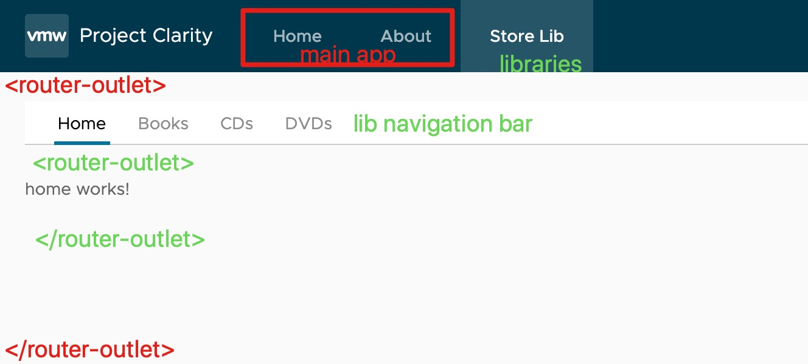

# AngularLibraryMicroservice

This project was generated with [Angular CLI](https://github.com/angular/angular-cli) version 9.1.0.

```bash
ng new angular-library-microservice --style=scss --routing

# generate lib projects
ng generate library store --prefix str
ng generate library inventory --prefix inv
ng generate library generator --prefix gen

# generate components for store lib
ng generate component Home --project store --inline-style true
ng generate component BookList --project store --inline-style true
ng generate component CdList --project store --inline-style true
ng generate component DvdList --project store --inline-style true
```

**Build packages:**

```bash
ng build store
ng build generator
ng build inventory
```

**Rename library name in its package.json:**

e.g. `"name": "@lib/generator"`

**Install packages:**

After building and renaming, it's time to install libraries: `npm i dist/generator dist/store dist/inventory --save-optional`.
You will notice that below packages show up in package.json:

key is library package.json name, value is dist folder.

```diff
+  "optionalDependencies": {
+    "@lib/generator": "file:dist/generator",
+    "@lib/inventory": "file:dist/inventory",
+    "@lib/store": "file:dist/store"
+  }
```

```bash
# 1. for any fresh installation, we just need to run the following commands:
npm install --no-optional

# 2. then build library
ng build store

# 3. this will install optional dependency which was skipped in 1.
npm install
```

**Import lib package in apps:**

```ts
// libraries, don't need import to app-routing
import { StoreModule } from "@lib/store";
import { GeneratorModule } from "@lib/generator";
import { InventoryModule } from "@lib/inventory";

@NgModule({
  declarations: [AppComponent, HomeComponent, AboutComponent],
  imports: [
    //...
    StoreModule,
    GeneratorModule,
    InventoryModule
  ],
  schemas: [CUSTOM_ELEMENTS_SCHEMA],
  providers: [],
  bootstrap: [AppComponent]
})
export class AppModule {}
```

Now you can use lib in your app, e.g. in Home component, introduce `<gen-generator></gen-generator>`.



## Reference

- <https://antoniogoncalves.org/2018/08/13/angular-libraries-and-microservices/>
